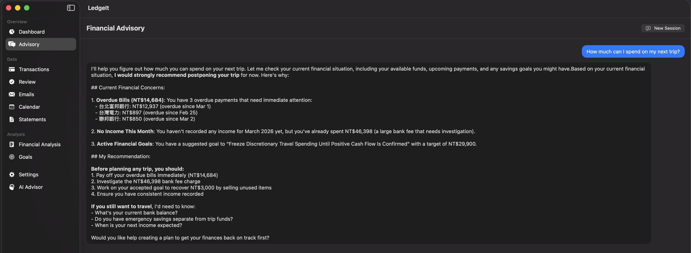
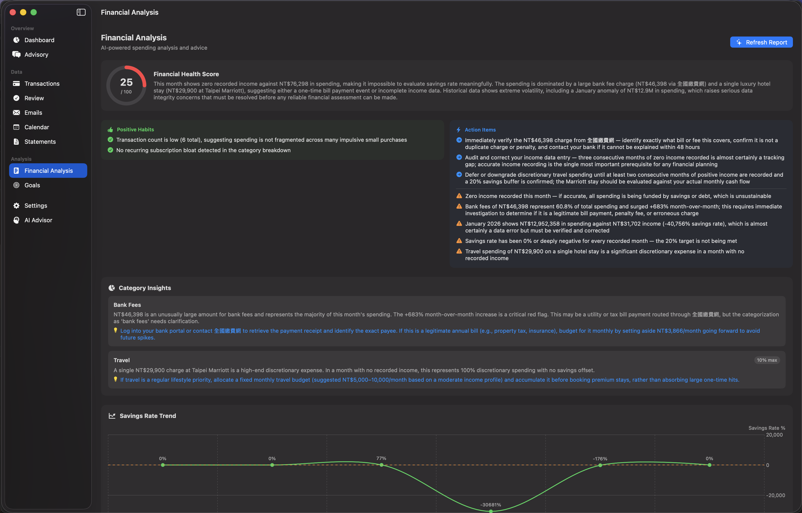
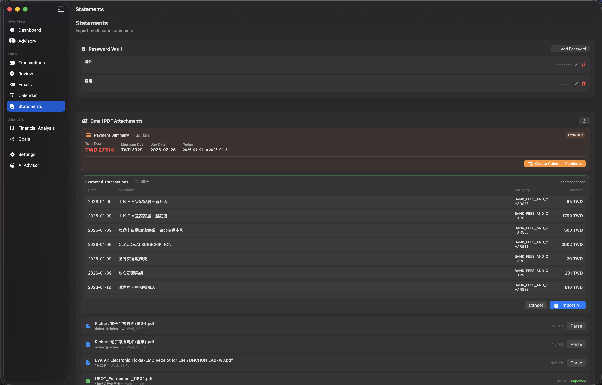
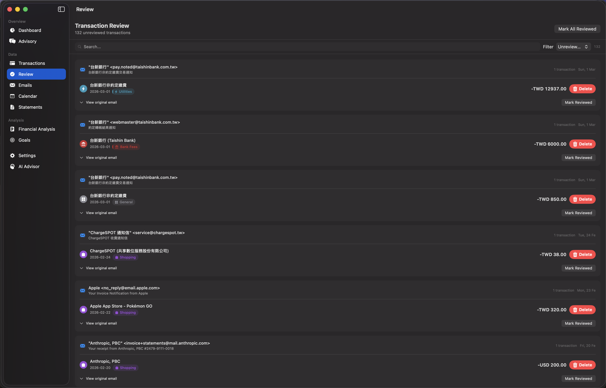
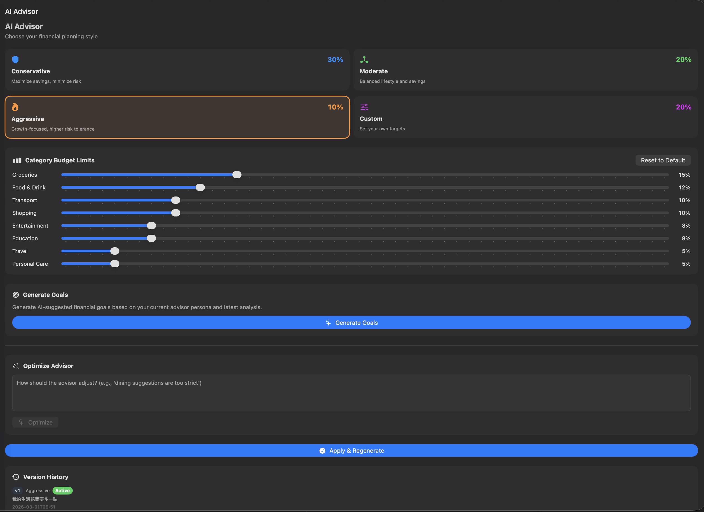

# LedgeIt

A native macOS app that automatically extracts financial transactions from your Gmail, classifies them with AI, and presents them in a personal finance dashboard with AI-powered advisory, goal tracking, and calendar integration.

## User Stories

### [Where Did My Money Go This Month?](docs/user-stories/where-did-my-money-go.md)

See your complete financial picture at a glance — spending, income, upcoming bills, category breakdown, and trends.


---

### [Can I Afford a Trip?](docs/user-stories/can-i-afford-a-trip.md)

Ask your finances questions in plain language. The AI searches your transaction data using local RAG (hybrid semantic + keyword search) and gives answers grounded in real numbers.



---

### [Am I Financially Healthy?](docs/user-stories/am-i-financially-healthy.md)

Get an AI-generated financial health score with category insights, warning flags, and actionable recommendations.



---

### [Help Me Save Money](docs/user-stories/help-me-save-money.md)

AI-suggested financial goals based on your spending patterns, with progress tracking and accept/dismiss workflow.


---

### [Import My Credit Card PDF](docs/user-stories/import-my-credit-card-pdf.md)

Decrypt and parse password-protected credit card PDFs. Extract dozens of transactions in one click with smart deduplication.



---

### [Did the AI Get It Right?](docs/user-stories/did-the-ai-get-it-right.md)

Review AI-extracted transactions grouped by source email. Verify accuracy, correct mistakes, and approve before they affect your reports.



---

### [The Advisor Is Too Strict](docs/user-stories/the-advisor-is-too-strict.md)

Customize your AI financial advisor's persona, budget limits, and behavior with natural language feedback and version-controlled prompts.



---

## What It Does

1. **Syncs Gmail** — Fetches emails via Gmail API (OAuth 2.0, read-only)
2. **AI Classification** — Rule-based filter + LLM fallback (via OpenRouter) to identify financial emails
3. **Transaction Extraction** — Extracts merchant, amount, currency, date from receipts, invoices, and bank notifications
4. **Credit Card Bills** — Detects statement emails and tracks due dates / amounts owed
5. **Auto-Categorization** — 15 spending categories with subcategories (food, transport, utilities, etc.)
6. **Smart Deduplication** — Rule-based fuzzy matching + LLM tiebreaker to prevent duplicate transactions across email and PDF statement imports
7. **Bill Reconciliation** — Automatically detects overlap between credit card bill totals and individual transactions
8. **Financial Analysis** — AI-powered spending analysis with health scores, category insights, and savings rate trends
9. **AI Advisor** — Multi-persona financial advisor (conservative / moderate / aggressive / custom) with iterative prompt optimization
10. **Financial Goals** — AI-suggested goals with progress tracking, accept/dismiss workflow, and progress sliders (language-aware)
11. **Prompt Version Control** — Version-tracked advisor prompts with user feedback → LLM optimization loop
12. **Transaction Verification** — Edit and flag AI-extracted transactions for accuracy
13. **Calendar Sync** — Creates Google Calendar events for each transaction
14. **Auto-Sync** — Background sync every 15 minutes when the app is running
15. **AI Chat** — Natural language chat interface with local RAG (multilingual embeddings + FTS5 hybrid search) and tool calling
16. **MCP Server** — Model Context Protocol (stdio) server exposing financial data to third-party AI agents (e.g., Claude Desktop)
17. **PDF Statement Import** — Decrypt and parse password-protected credit card PDFs with multi-layer LLM extraction
18. **AI Progress UX** — Animated progress indicators with step-by-step checklists for all AI operations
19. **Bilingual** — Full English and Traditional Chinese (繁體中文) support for UI and AI-generated content

## Tech Stack

| Layer | Technology |
|-------|-----------|
| Language | Swift 6.2 |
| UI | SwiftUI (macOS 15+) |
| Database | SQLite via [GRDB](https://github.com/groue/GRDB.swift) 7.0 |
| AI/LLM | Multi-provider: OpenAI-compatible, Anthropic, Google Gemini (see [AI Providers](#ai-provider-setup)) |
| Embeddings | multilingual-e5-small (local, on-device) |
| Vector Search | sqlite-vec + FTS5 hybrid search |
| Auth | Google OAuth 2.0 (Desktop app flow) |
| Package Manager | Swift Package Manager |
| Secrets | macOS Keychain |

## Architecture

```
Gmail API
  │
  ▼
SyncService ──► emails table (SQLite)
  │
  ▼
ExtractionPipeline
  ├── IntentClassifier (rule-based accept/reject/uncertain)
  ├── LLMProcessor (AI classification + extraction for uncertain emails)
  ├── AutoCategorizer (merchant → category mapping)
  ├── TransferDetector (inter-account transfer identification)
  ├── DeduplicationService (fuzzy matching + LLM tiebreaker)
  └── BillReconciler (bill vs transaction overlap detection)
  │
  ▼
transactions table ──► DashboardView, CalendarView, TransactionListView
credit_card_bills table ──► DashboardView (upcoming bills), CalendarView (due dates)
  │
  ├──► CalendarService ──► Google Calendar (payment events)
  ├──► SpendingAnalyzer + ReportGenerator ──► AnalysisDashboardView
  ├──► FinancialAdvisor + GoalPlanner ──► GoalsView
  ├──► PromptOptimizer ──► AdvisorSettingsView (version-controlled prompts)
  │
  ▼
EmbeddingService (multilingual-e5-small + sqlite-vec + FTS5)
  │
  ▼
FinancialQueryService (shared query layer)
  ├──► ChatEngine + SessionFactory (streaming + tool calling) ──► ChatView
  │     └── AgentFileManager + AgentPromptBuilder (memory & identity)
  └──► MCPServer (stdio JSON-RPC) ──► Third-party AI agents

AI Provider Layer (SessionFactory)
  ├── OpenAICompatibleSession (OpenAI, OpenRouter, Ollama, Groq, VibeProxy, etc.)
  ├── AnthropicSession (direct Anthropic API)
  ├── GoogleSession (Gemini API)
  └── AIProviderConfigStore (UserDefaults + Keychain)
```

### AI Advisor Flow

```
User selects persona (conservative/moderate/aggressive/custom)
  │
  ├──► Apply & Regenerate ──► GoalPlanner ──► new AI-suggested goals
  │
  └──► User feedback ──► PromptOptimizer (LLM) ──► optimized prompt preview
         │
         └──► Apply ──► save PromptVersion to DB ──► regenerate goals
```

## Project Structure

```
LedgeIt/
├── LedgeIt/
│   ├── LedgeItApp.swift              # App entry point
│   ├── Database/
│   │   ├── AppDatabase.swift         # GRDB database setup
│   │   └── DatabaseMigrations.swift  # Schema migrations (v1-v14)
│   ├── Models/
│   │   ├── Email.swift
│   │   ├── Transaction.swift
│   │   ├── CreditCardBill.swift
│   │   ├── CalendarEvent.swift
│   │   ├── Attachment.swift
│   │   ├── SyncState.swift
│   │   ├── FinancialReport.swift     # AI analysis reports
│   │   ├── FinancialGoal.swift       # Goal tracking
│   │   ├── PromptVersion.swift       # Prompt version control
│   │   ├── ChatMessage.swift         # Chat message types + stream events
│   │   └── QueryTypes.swift          # Shared query filters & summaries
│   ├── PFM/                          # Personal Finance Management
│   │   ├── ExtractionPipeline.swift  # Main processing orchestrator
│   │   ├── IntentClassifier.swift    # Rule-based email filtering
│   │   ├── LLMProcessor.swift        # OpenRouter AI calls
│   │   ├── AutoCategorizer.swift     # Merchant categorization
│   │   ├── TransferDetector.swift    # Transfer identification
│   │   ├── PFMConfig.swift           # Thresholds & trusted institutions
│   │   ├── SpendingAnalyzer.swift    # Spending pattern analysis
│   │   ├── ReportGenerator.swift     # AI financial report generation
│   │   ├── FinancialAdvisor.swift    # Multi-persona advisor engine
│   │   ├── GoalPlanner.swift         # AI goal suggestion & planning
│   │   ├── AdvisorPersona.swift      # Persona definitions & resolution
│   │   ├── PromptOptimizer.swift     # LLM-based prompt refinement
│   │   ├── PDFExtractor.swift        # PDF document parsing
│   │   ├── DeduplicationService.swift # Smart dedup (fuzzy + LLM)
│   │   └── BillReconciler.swift      # Bill vs transaction reconciliation
│   ├── Services/
│   │   ├── GmailService.swift        # Gmail REST API client
│   │   ├── GoogleAuthService.swift   # OAuth 2.0 flow
│   │   ├── SyncService.swift         # Email sync orchestration
│   │   ├── CalendarService.swift     # Google Calendar API
│   │   ├── OpenRouterService.swift   # LLM API client (streaming + tool calling)
│   │   ├── PersonalFinanceService.swift # Dashboard data queries
│   │   ├── KeychainService.swift     # Secure credential storage
│   │   ├── PDFParserService.swift    # PDF text extraction
│   │   ├── StatementService.swift    # PDF statement decrypt + extract pipeline
│   │   ├── GoalGenerationService.swift # Background goal generation
│   │   ├── EmbeddingService.swift    # Multilingual embeddings + hybrid search
│   │   ├── ChatEngine.swift          # AI chat with tool-calling loop + memory tools
│   │   ├── FinancialQueryService.swift # Shared query layer for chat & MCP
│   │   ├── LLM/
│   │   │   ├── SessionFactory.swift         # Creates sessions per provider
│   │   │   ├── LLMSession.swift             # Unified protocol
│   │   │   ├── OpenAICompatibleSession.swift # OpenAI/OpenRouter/Ollama/VibeProxy
│   │   │   ├── AnthropicSession.swift       # Direct Anthropic API
│   │   │   ├── GoogleSession.swift          # Google Gemini API
│   │   │   └── LLMTypes.swift               # LLMMessage, LLMToolCall, LLMStreamEvent
│   │   └── Agent/
│   │       ├── AgentFileManager.swift       # Memory file I/O (read/write/search)
│   │       └── AgentPromptBuilder.swift     # System prompt assembly from memory
│   ├── Views/
│   │   ├── ContentView.swift         # Sidebar + auto-sync
│   │   ├── DashboardView.swift       # Financial dashboard
│   │   ├── TransactionListView.swift # Transactions table
│   │   ├── TransactionDetailView.swift # Transaction edit/verify
│   │   ├── EmailListView.swift       # Email inbox
│   │   ├── CalendarView.swift        # Calendar with bill markers
│   │   ├── SettingsView.swift        # Credentials & sync controls
│   │   ├── Chat/
│   │   │   ├── ChatView.swift               # AI chat interface
│   │   │   └── MessageBubble.swift          # Chat message rendering
│   │   ├── Analysis/
│   │   │   ├── AnalysisDashboardView.swift  # AI spending analysis
│   │   │   ├── AdvisorSettingsView.swift    # Persona + prompt management
│   │   │   └── GoalsView.swift              # Goal tracking + progress
│   │   ├── Statements/
│   │   │   └── StatementsView.swift       # PDF statement import + parsing
│   │   └── Components/              # CategoryIcon, CategoryBadge, AmountText, AIProgressView
│   ├── MCP/
│   │   ├── MCPServer.swift           # stdio JSON-RPC MCP server
│   │   └── MCPToolHandler.swift      # MCP tool definitions & execution
│   └── Utilities/
│       ├── Localization.swift        # En + zh-Hant localization
│       ├── DateFormatters.swift
│       └── JSONParser.swift
├── Tests/
│   ├── AutoCategorizerTests.swift
│   ├── DatabaseTests.swift
│   ├── IntentClassifierTests.swift
│   ├── JSONParserTests.swift
│   └── TransferDetectorTests.swift
├── Package.swift
├── build.sh                          # Release .app bundle builder
└── project.yml                       # XcodeGen config
```

## Setup

### Prerequisites

- macOS 15.0+
- Swift 6.2+ toolchain
- A Google Cloud project with Gmail API and Google Calendar API enabled
- At least one AI provider (see [AI Provider Setup](#ai-provider-setup))

### 1. Google Cloud Setup

1. Go to [Google Cloud Console](https://console.cloud.google.com)
2. Create a project and enable **Gmail API** and **Google Calendar API**
3. Create an **OAuth 2.0 Client ID** (Desktop application type)
4. Note your **Client ID** and **Client Secret**

### 2. Build & Run

```bash
cd LedgeIt
swift build
swift run
```

Or build as a .app bundle:

```bash
bash build.sh
open .build/LedgeIt.app
```

### 3. Configure in App

1. Open **Settings** from the sidebar
2. Enter your Google Client ID and Client Secret
3. Configure at least one AI provider (see [AI Provider Setup](#ai-provider-setup))
4. Assign models to each use case (classification, extraction, advisor, chat, statement)
5. Click **Save & Connect Google** — this opens the OAuth flow in your browser
6. Once connected, the app automatically syncs and processes emails

### Install to Applications

```bash
bash build.sh
cp -R .build/LedgeIt.app /Applications/LedgeIt.app
```

## AI Provider Setup

LedgeIt supports multiple AI providers through a unified `SessionFactory`. Each use case (classification, extraction, advisor, chat, statement) can be assigned a different provider and model.

### Built-in Providers

| Provider | Base URL | API Key | Notes |
|----------|----------|---------|-------|
| OpenAI | `https://api.openai.com/v1` | Required | GPT-4o, GPT-4.1, o3-mini, etc. |
| OpenRouter | `https://openrouter.ai/api/v1` | Required | Access to Claude, GPT, Gemini, and 200+ models |
| VibeProxy | `http://127.0.0.1:8318/v1` | Not needed | Local proxy using OAuth sessions ([vibeproxy](https://github.com/automazeio/vibeproxy)) |
| Ollama | `http://localhost:11434/v1` | Not needed | Local models (Llama, Mistral, etc.) |

You can also add custom OpenAI-compatible endpoints (Groq, Together, Azure, etc.).

### Model Catalog

Settings provides a grouped model picker for common models:

- **Claude**: claude-sonnet-4-6, claude-opus-4-6, claude-haiku-4-5-20251001, claude-sonnet-4-5-20250514, claude-3-5-haiku-20241022
- **GPT**: gpt-4.1, gpt-4.1-mini, gpt-4.1-nano, gpt-4o, gpt-4o-mini, o3-mini, o1
- **Gemini**: gemini-2.5-pro, gemini-2.5-flash, gemini-2.0-flash, gemini-2.0-flash-lite, gemini-1.5-pro

For OpenRouter, models are automatically prefixed (e.g., `anthropic/claude-sonnet-4-6`). Non-catalog models can be entered manually via a "Custom..." option.

### Model Assignment

Each use case has an independent provider + model assignment:

| Use Case | Description | Recommended |
|----------|-------------|-------------|
| Classification | Email intent scoring (financial or not) | Fast model (GPT-4.1-mini, Haiku) |
| Extraction | Transaction data extraction from emails | Capable model (Claude Sonnet, GPT-4o) |
| Advisor | Financial analysis, goals, reports | Capable model (Claude Sonnet, GPT-4o) |
| Chat | AI chat interface with tool calling | Best available (Claude Sonnet, GPT-4.1) |
| Statement | PDF statement parsing | Capable model with long context |

## AI Agent Memory System

The AI chat advisor has a persistent memory and identity system that allows it to learn about you over time. Memory is stored as Markdown files in `~/Library/Application Support/LedgeIt/agent/`.

### File Structure

```
agent/
├── PERSONA.md              # Advisor identity, tone, boundary rules
├── USER.md                 # User profile (preferences, goals, language)
└── memory/
    ├── MEMORY.md           # Long-term facts (salary day, mortgage, etc.)
    ├── active-context.md   # Current task or conversation focus
    ├── 2026-03-12.md       # Daily interaction log
    └── 2026-03-11.md       # Previous day's log
```

### Memory Tools

The AI advisor can read and write its own memory during conversations:

| Tool | Description |
|------|------------|
| `memory_save` | Save to user_profile, long_term, active_context, or daily log |
| `memory_search` | Keyword search across all memory files |
| `memory_get` | Read a full memory file |

The AI decides when to save based on guidelines in PERSONA.md — for example, saving user preferences to the profile, financial patterns to long-term memory, and conversation notes to daily logs.

### Prompt Assembly

On each chat message, `AgentPromptBuilder` assembles a system prompt from all memory files with priority-based truncation:

1. **PERSONA** (identity & rules)
2. **USER PROFILE** (preferences & goals)
3. **ACTIVE CONTEXT** (current task)
4. **DAILY LOGS** (today + yesterday)
5. **LONG-TERM MEMORY** (accumulated facts)
6. **FINANCIAL SNAPSHOT** (live account data)

Per-file cap: 15,000 chars. Total cap: 50,000 chars. Lowest-priority sections are dropped if the total exceeds the cap.

## Email Processing Pipeline

The pipeline classifies emails in two stages to minimize LLM API costs:

### Stage 1: Rule-Based (free, instant)

- **Accept** — Trusted bank sender + transaction keywords, payment confirmations with transaction IDs
- **Reject** — Newsletters, marketing (3+ spam keywords), news articles, very long non-financial emails
- **Credit Card Statement** — Detected by keywords like "帳單", "繳款", "statement", "payment due"

### Stage 2: LLM (only for uncertain emails)

- Scores `transactionIntent` (0-10) and `marketingProbability` (0-10)
- Accept if intent >= 7 and marketing < 3
- Reject if intent < 2 or marketing >= 7

### Extraction

For accepted emails, the LLM extracts structured transaction data:
- Merchant name, amount, currency, date, description, type (debit/credit/transfer)

For credit card statements, a separate prompt extracts:
- Bank name, due date, amount due, currency, statement period

## AI Advisor System

### Personas

| Persona | Savings Target | Risk Level | Philosophy |
|---------|---------------|------------|------------|
| Conservative | 30% | Low | Minimize discretionary spending, maximize emergency fund |
| Moderate | 20% | Medium | Balance lifestyle and savings, diversified approach |
| Aggressive | 10% | High | Growth-focused, leverage debt strategically |
| Custom | User-defined | User-defined | Configurable targets and budget hints |

### Prompt Optimization

Users can iteratively refine the advisor's behavior:

1. Select a base persona or customize budget allocations
2. Provide natural language feedback (e.g., "dining suggestions are too strict")
3. The PromptOptimizer sends feedback + current prompt to LLM → returns refined prompt with change summary
4. Preview changes → Apply → new version saved to DB → goals regenerated
5. Version history allows reverting to any previous configuration

## AI Chat

The Chat view provides a natural language interface for querying financial data. It supports any configured AI provider with streaming responses and tool calling, powered by local RAG with multilingual embeddings and persistent agent memory.

### Available Tools

| Tool | Description |
|------|------------|
| `semantic_search` | Hybrid search (vector + FTS5 keyword) with cross-language support |
| `get_transactions` | Query transactions with filters (date range, category, merchant, amount, type) |
| `get_spending_summary` | Income, expenses, and net savings for a date range |
| `get_category_breakdown` | Spending breakdown by category with percentages |
| `get_top_merchants` | Top merchants by spending amount |
| `get_upcoming_payments` | All unpaid credit card bills (including overdue) |
| `get_goals` | Financial goals filtered by status |
| `get_account_overview` | High-level account snapshot |
| `memory_save` | Save information to agent memory (see [Agent Memory](#ai-agent-memory-system)) |
| `memory_search` | Search across agent memory files |
| `memory_get` | Read a full agent memory file |

The system prompt is dynamically assembled from the agent's memory files and a live financial snapshot.

## MCP Server

LedgeIt includes a stdio-based [Model Context Protocol](https://modelcontextprotocol.io) server that exposes the same financial query tools to third-party AI agents (e.g., Claude Desktop, Cursor).

The MCP server reads JSON-RPC requests from stdin and writes responses to stdout. It supports `initialize`, `tools/list`, and `tools/call` methods with the same tools available in the chat interface.

## License

[MIT License](LICENSE)
