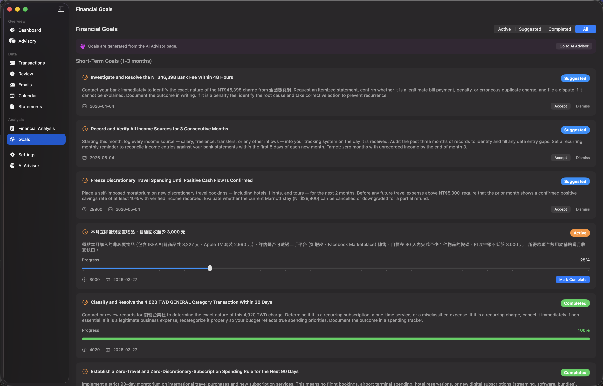

# Help Me Save Money

> **As a user**, I want AI-suggested financial goals with progress tracking, so I have concrete targets to work toward and can see my progress over time.

## The Problem

Knowing you should "save more" isn't helpful. You need specific, actionable goals with deadlines and progress tracking. But creating financial goals requires understanding your spending patterns, identifying opportunities, and setting realistic targets — which is a lot of work.

## How LedgeIt Solves It

The **Financial Goals** view shows AI-generated goals based on your actual spending data:

### Goal Lifecycle

Goals flow through a clear lifecycle: **Suggested** → **Active** → **Completed**

Filter by status using the tabs at the top: Active | Suggested | Completed | All

### Short-Term Goals (1-3 months)

AI analyzes your spending and suggests specific, time-bound goals:

- **"Investigate and Resolve the NT$46,398 Bank Fee Within 48 Hours"** — Contact your bank to identify the charge, request itemized statement, file a dispute if needed
- **"Record and Verify All Income Sources for 3 Consecutive Months"** — Set up monthly reconciliation, target: zero months with unrecorded income
- **"Freeze Discretionary Travel Spending Until Positive Cash Flow Is Confirmed"** — Moratorium on new travel bookings for 2 months, with NT$29,900 target

### Active Goals with Progress

Accepted goals show a progress slider you can update:
- **"本月立即變現閒置物品，目標回收至少 3,000 元"** — Currently at 25% progress, target NT$3,000 by March 27

### Completed Goals

Track what you've already accomplished:
- **"Classify and Resolve the 4,020 TWD GENERAL Category Transaction"** — 100% complete with green progress bar

### Key Features

- Goals are generated from the AI Advisor page (configurable persona)
- Each goal has a target amount, deadline, and detailed action plan
- Accept or dismiss suggested goals based on your priorities
- Mark goals complete when you've achieved them
- Bilingual support — goals are generated in the language you use
