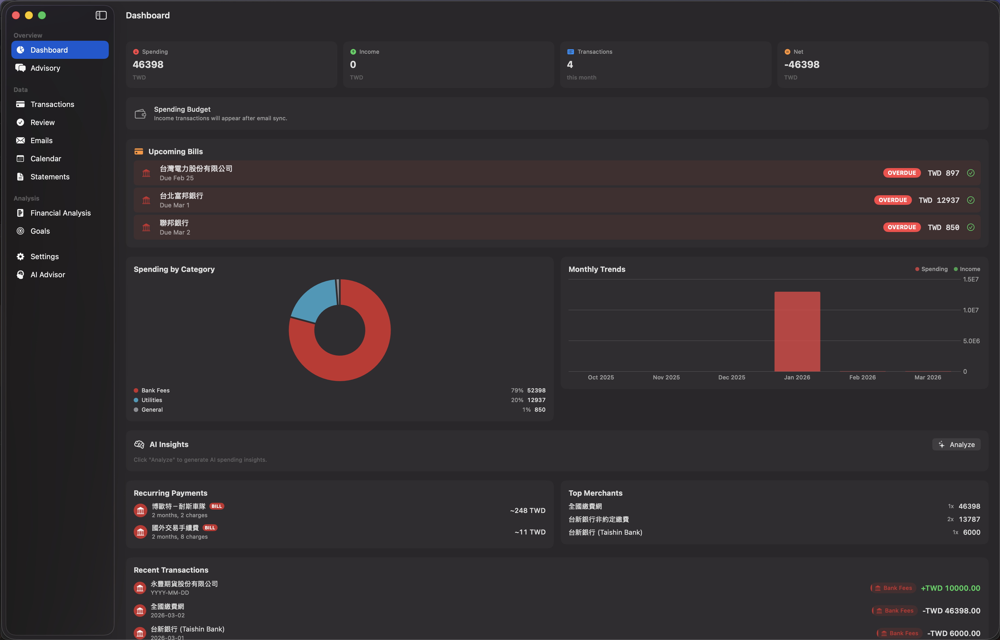

# Where Did My Money Go This Month?

> **As a user**, I want to see a clear overview of my monthly spending, income, and upcoming bills at a glance, so I can quickly understand my financial situation without digging through bank statements.

## The Problem

You check your bank balance and it's lower than expected. You have multiple credit cards, recurring payments, and dozens of small purchases scattered across different merchants. Piecing together where your money went means logging into multiple banking apps and scrolling through endless transaction lists.

## How LedgeIt Solves It

The **Dashboard** is the first thing you see when you open LedgeIt. It gives you a complete financial snapshot:

- **Monthly Summary Cards** — Total spending, income, transaction count, and net balance for the current month
- **Spending Budget** — Visual indicator of how you're tracking against your budget
- **Upcoming Bills** — Credit card bills with due dates and overdue warnings (red OVERDUE badges)
- **Spending by Category** — Donut chart breaking down where your money went (Bank Fees, Utilities, General, etc.)
- **Monthly Trends** — Bar chart showing spending vs income over the past 6 months
- **AI Insights** — One-click AI analysis of your spending patterns
- **Recurring Payments** — Auto-detected recurring charges with average amounts
- **Top Merchants** — Which merchants are getting most of your money
- **Recent Transactions** — Latest transactions with category badges and amounts

## Key Features

- All data is extracted automatically from Gmail — no manual entry
- Overdue bills are highlighted with red badges so you never miss a payment
- Category breakdown helps identify spending patterns at a glance
- Monthly trends reveal whether your spending is increasing or decreasing over time
